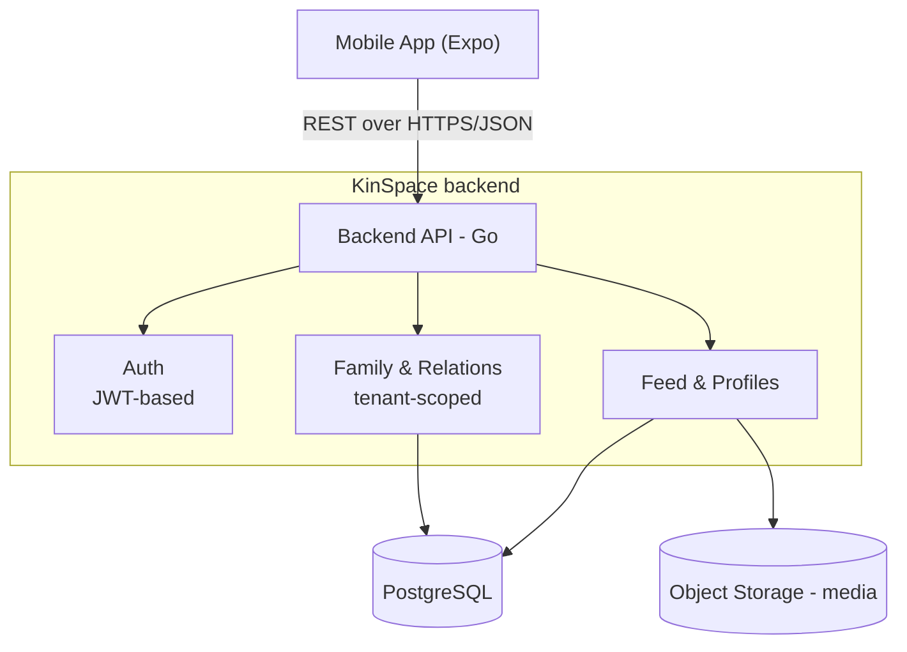

# KinSpace

**A private, structured operating system for family life.**

[](https://go.dev)
[](https://expo.dev)
[](https://www.postgresql.org)
[](LICENSE)
[]()

KinSpace centralizes communication, organization, and mutual support within a closed family network. It is not a social network in the public sense — no ads, no algorithmic feed, no public surface. Every family owns a private, invite-only space, structured around how families actually work: relationships, roles, and shared trust.

<!--  -->

---

## Table of Contents

- [Overview](#overview)
- [Why KinSpace](#why-kinspace)
- [Features](#features)
- [Tech Stack](#tech-stack)
- [Architecture](#architecture)
- [Data Model](#data-model)
- [Getting Started](#getting-started)
- [API Documentation](#api-documentation)
- [Project Structure](#project-structure)
- [Roadmap](#roadmap)
- [Contributing](#contributing)
- [License](#license)

---

## Overview

Most families coordinate their lives across a patchwork of tools never designed for the job: chat apps for conversation, cloud drives for documents, social networks for photos, spreadsheets for everything else. Information gets fragmented, context gets lost, and none of these tools understand what makes a family a family — its structure of relationships.

KinSpace replaces that patchwork with a single, private, structured space: a family feed, a relationship graph, shared profiles, and — in later phases — shared documents, scheduling, and a mutual-aid network built on the skills and professions already present within the family.

## Why KinSpace

- **Private by design.** Invite-only membership, no public surface, no ad-driven data model.
- **Structured around relationships, not a flat contact list.** The family graph is a first-class part of the data model, not an afterthought bolted onto a generic social feed.
- **Built for durability.** Family history — relationships, records, media — is meant to persist for years, not scroll away.

## Features

| | |
|---|---|
| **Private family feed** | Text and image posts visible only to invited family members. |
| **Member profiles** | Role, profession, skills, and bio for each member — a structured directory of the family, not a list of names. |
| **Family tree** | Typed, bidirectional relationship graph (parent, sibling, spouse, cousin, ...), with inverse relations derived server-side. |
| **Mutual aid network** | Request help or share opportunities using skills already tagged on members' profiles. |
| **Family calendar** *(planned)* | Events and reminders, including relationship-derived events such as birthdays. |
| **Family vault** *(planned)* | Encrypted storage for sensitive documents. |
| **Internal messaging** *(planned)* | Real-time chat between members. |

## Tech Stack

| Component | Choice |
|---|---|
| Mobile frontend | React Native ([Expo](https://expo.dev)), TypeScript |
| Backend | Go, [Gin](https://gin-gonic.com/) / [Fiber](https://gofiber.io/) |
| API | REST, versioned under `/api/v1` |
| Auth | JWT |
| Database | PostgreSQL |
| Media storage | S3-compatible object storage |
| Infrastructure | Docker / Docker Compose (local dev), GitHub Actions (CI/CD) |

## Architecture



Every request is scoped to a `family_id`. The backend enforces strict tenant isolation, so one family's data is never reachable through another family's session.

## Data Model

```go
User {
  ID           uuid
  Name         string
  Email        string
  PasswordHash string
  FamilyID     uuid
  Role         string    // display label, derived from Relation when possible
  Profession   string
  Bio          string
  Skills       []string  // tags surfaced in the mutual aid network
  CreatedAt    time.Time
}

Family {
  ID         uuid
  Name       string
  InviteCode string
  CreatedAt  time.Time
}

Post {
  ID        uuid
  FamilyID  uuid
  AuthorID  uuid
  Content   string
  ImageURL  string
  CreatedAt time.Time
}

Relation {
  ID            uuid
  FamilyID      uuid
  UserID        uuid
  RelatedUserID uuid
  Type          string // parent, child, spouse, sibling, uncle_aunt, cousin...
  CreatedAt     time.Time
}
```

Relationships are stored as a typed graph: each edge is persisted once, and its inverse (e.g. `parent` ↔ `child`) is derived server-side. This avoids duplicate or inconsistent state as the family tree grows.

## Getting Started

### Prerequisites

- Go 1.22+
- Node.js 18+ and npm or yarn
- PostgreSQL 15+
- Expo CLI (`npm install -g expo-cli`)

### 1. Clone the repository

```bash
git clone https://github.com/<org>/kinspace.git
cd kinspace
```

### 2. Backend

```bash
cd backend
cp .env.example .env   # configure DB credentials and JWT secret
go mod tidy
go run cmd/api/main.go
```

### 3. Mobile app

```bash
cd mobile
npm install
npx expo start
```

Component-specific setup details live in `backend/README.md` and `mobile/README.md`.

## API Documentation

The REST API is versioned under `/api/v1`. Endpoint reference (Auth, Family, User, Post, Relation) is maintained in [`docs/API.md`](docs/API.md).

## Project Structure

```
kinspace/
├── backend/          → Go API service
│   ├── cmd/api/       → entry point
│   └── internal/      → domain logic, handlers, data access
├── mobile/           → Expo mobile application
├── docs/
│   └── API.md         → endpoint reference
├── .github/
│   └── workflows/     → CI/CD pipelines
├── README.md
├── .gitignore
└── LICENSE
```

## Roadmap

- [x] Data model and system design
- [ ] Authentication (register/login, JWT)
- [ ] Family creation and invite flow
- [ ] Feed (text and image posts)
- [ ] Member profiles with skills
- [ ] Family tree (relationship graph, basic UI)
- [ ] Calendar and events
- [ ] Encrypted family vault
- [ ] Real-time messaging

## Contributing

Issues and pull requests are welcome. If you're adding a new domain feature, start from the handlers in `backend/internal` — tenant isolation (`family_id` scoping) must be preserved in every new query.

## License

Licensed under the [MIT License](LICENSE).